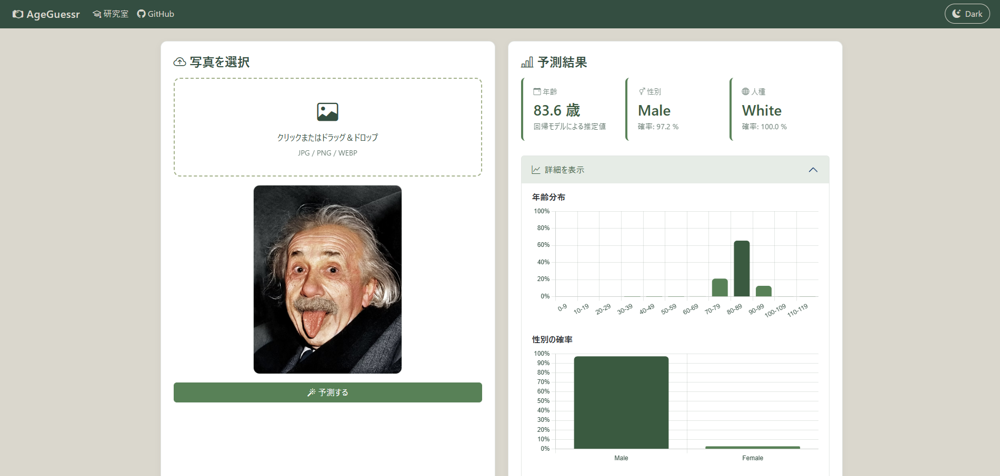

# AgeGuessr
[](https://github.com/Shimoyama-h26ms419/AgeGuessr) [](https://www.python.org/downloads/release/python-3145/) [](https://pytorch.org/)



## 0. TL;DR
- 2026年度 弘前大学オープンキャンパスの水田研究室の展示です

## 1. Overview（概要）
- MaxViT モデルを使用して UTKFace データセットを学習しました
- 学習の過程で作成したモデルを利用し、撮影した顔写真から年齢、性別などを推定します
- 推定部分には Flask を利用したWebアプリを自作しました


## 2. Setup（環境構築）
以下の手順に従って、環境構築を行います。

### 2.1 Pythonのインストール
1. [**Python公式ページ**](https://www.python.org/downloads/release/python-3145/) から **Python 3.14.5** をインストールします。
2. `PATH` を通してターミナルから **Python 3.14.5** を起動できることを確認します。

### 2.2 リポジトリのクローン
ディレクトリは分かりやすい場所ならばどこでも構いません。

```
git clone https://github.com/Shimoyama-h26ms419/AgeGuessr.git
```

次に、作業ディレクトリに移動します。
```
cd ./AgeGuessr
```

### 4.3 仮想環境の作成
仮想環境（venv）の作成を行います。 以下のコマンドで仮想環境を `.venv` ディレクトリに作成します。

```
py -3.14 -m venv ./.venv 
```


### 4.4 必要ライブラリのインストール
必要なライブラリなどを一括でインストールします。 以下のコマンドを順に実行してインストールします。

```
pip install torch torchvision --index-url https://download.pytorch.org/whl/cu132
pip install ipywidgets transformers[torch]
pip install -r requirements.txt
```


## 3. Usage（使い方）
以下のコマンドで Flask を立ち上げます。

```
python ./app.py
```

起動すると `localhost:5000` でアクセスすることができます。 


## 4. ToDo
- モデルの予測があまりよろしくないので
  - 別のデータセットを使う
  - 高解像度版のモデルを使う
  - 回帰の方法を変える
  - 学習率スケジューラを変更


## 5. Reference（参考文献）
- Tu, Zhengzhong, et al. "Maxvit: Multi-axis vision transformer." _European conference on computer vision_. Cham: Springer Nature Switzerland, 2022.
